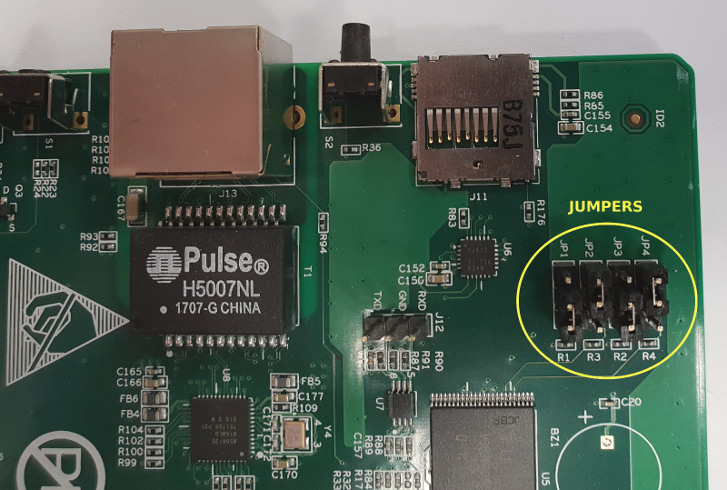
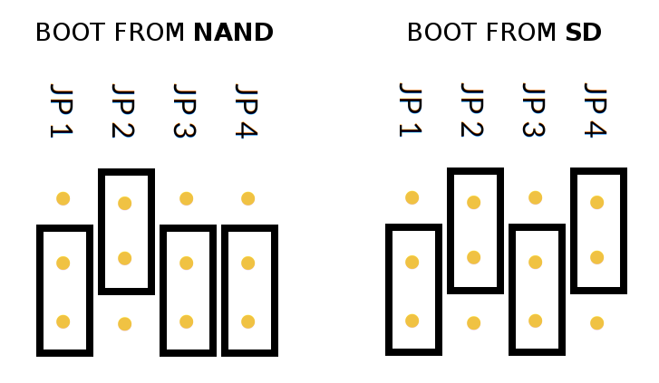

# Control board
Below is a list of hardware pins of S9 control boards. These are Xilinx based devices with 256 MB, 512 MB, or 1024 MB of RAM resp.

## Boot Modes

The figure below shows JP1-JP4 settings for selecting the desired boot mode.

## Hash Board Connector Pins (J1-J9)

| 1 | 3 | 5 | 7 | 9 | 11 | 13 | 15 | 17 |
|---|---|---|---|---|---|---|---|---|
| GND | TSDA| PLUG | A1 | GND | TX | GND | RST | TEST? |
| **2** | **4** | **6** | **8** | **10** | **12** | **14** | **16** | **18** |
| GND | TSCL | A2 | A0 | GND | RX | GND | 3V3 | EN |

## Address Pins

| Connector | A2 | A1 | A0 |
|---|---|---|---|
| J6 (5) | 1 | 0 | 1 |
| J7 (6) | 1 | 1 | 0 |
| J8 (7) | 1 | 1 | 1 |

## Fan Pins (FAN1-FAN6)

| 1 | 2 | 3 | 4 |
|---|---|---|---|
| GND | +12V | RPM | PWM |
